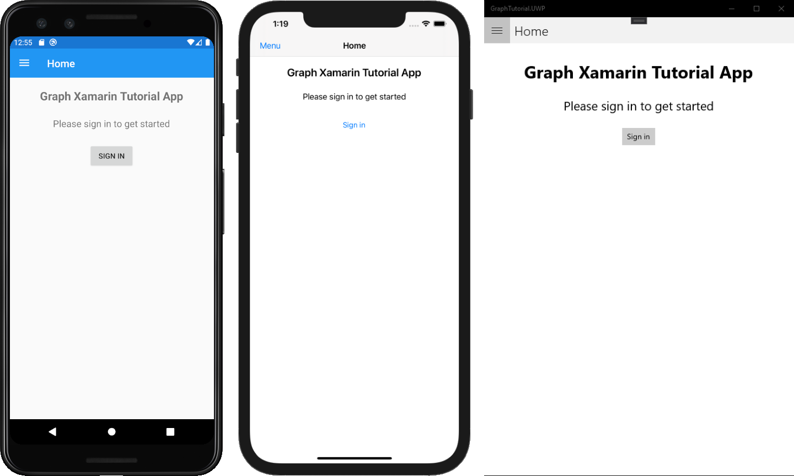

<!-- markdownlint-disable MD002 MD041 -->

1. Öffnen Sie Visual Studio, und wählen Sie **Neues Projekt erstellen**.

1. Wählen Sie im Dialogfeld **Neues Projekt erstellen** die Option **Mobile App (Xamarin. Forms)** aus, und wählen Sie dann **weiter**aus.

    

1. Geben `GraphTutorial` Sie im Dialogfeld **Neues Projekt konfigurieren** für den **Projektnamen** und den **Lösungsnamen**ein, und wählen Sie dann **Erstellen**aus.

    > [!IMPORTANT]
    > Stellen Sie sicher, dass Sie genau den gleichen Namen für das Visual Studio Projekt eingeben, das in diesen Übungseinheiten angegeben ist. Der Visual Studio-Projektname wird Teil des Namespace im Code. Der Code in diesen Anweisungen hängt vom Namespace ab, der mit dem in diesen Anweisungen angegebenen Visual Studio-Projektnamen übereinstimmt. Wenn Sie einen anderen Projektnamen verwenden, wird der Code nicht kompiliert, es sei denn, Sie passen alle Namespaces so an, dass Sie dem von Ihnen beim Erstellen des Projekts eingegebenen Visual Studio-Projektnamen entsprechen.

    

1. Wählen Sie im Dialogfeld **neue plattformübergreifende App** die **leere** Vorlage aus, und wählen Sie die Plattformen aus, die Sie unter **Plattformen**erstellen möchten. Wählen Sie **OK** aus, um die Lösung zu erstellen.

    

## <a name="install-packages"></a>Installieren von Paketen

Bevor Sie fortfahren, installieren Sie einige zusätzliche NuGet-Pakete, die Sie später verwenden werden.

- [Microsoft. Identity. Client](https://www.nuget.org/packages/Microsoft.Identity.Client/) zum behandeln Azure AD Authentifizierung und Tokenverwaltung.
- [Microsoft. Graph](https://www.nuget.org/packages/Microsoft.Graph/) für das tätigen von Anrufen an Microsoft Graph.

1. Wählen Sie **Extras > NuGet-Paket-Manager > Paket-Manager-Konsole**aus.

1. Geben Sie in der Paket-Manager-Konsole die folgenden Befehle ein:

    ```Powershell
    Install-Package Microsoft.Identity.Client -Version 4.10.0 -Project GraphTutorial
    Install-Package Microsoft.Identity.Client -Version 4.10.0 -Project GraphTutorial.Android
    Install-Package Microsoft.Identity.Client -Version 4.10.0 -Project GraphTutorial.iOS
    Install-Package Microsoft.Graph -Version 3.0.1 -Project GraphTutorial
    ```

## <a name="design-the-app"></a>Entwerfen der App

Aktualisieren Sie zunächst die `App` Klasse, um Variablen hinzuzufügen, um den Authentifizierungsstatus und den angemeldeten Benutzer nachzuverfolgen.

1. Erweitern Sie im **Projektmappen-Explorer**das **GraphTutorial** -Projekt, und erweitern Sie dann die Datei **app. XAML** . Öffnen Sie die Datei **app.XAML.cs** , und fügen `using` Sie die folgenden Anweisungen am Anfang der Datei hinzu.

    ```csharp
    using System.ComponentModel;
    using System.IO;
    using System.Reflection;
    using System.Threading.Tasks;
    ```

1. Fügen Sie `INotifyPropertyChanged` die Schnittstelle zur Klassendeklaration hinzu.

    ```csharp
    public partial class App : Application, INotifyPropertyChanged
    ```

1. Fügen Sie der `App` Klasse die folgenden Eigenschaften hinzu.

    :::code language="csharp" source="../demo/GraphTutorial/GraphTutorial/App.xaml.cs" id="GlobalPropertiesSnippet":::

1. Fügen Sie der `App` -Klasse die folgenden Funktionen hinzu. Die `SignIn`- `SignOut`,- `GetUserInfo` und-Funktionen sind jetzt nur Platzhalter.

    ```csharp
    public async Task SignIn()
    {
        await GetUserInfo();

        IsSignedIn = true;
    }

    public async Task SignOut()
    {
        UserPhoto = null;
        UserName = string.Empty;
        UserEmail = string.Empty;
        IsSignedIn = false;
    }

    private async Task GetUserInfo()
    {
        UserPhoto = ImageSource.FromStream(() => GetUserPhoto());
        UserName = "Adele Vance";
        UserEmail = "adelev@contoso.com";
    }

    private Stream GetUserPhoto()
    {
        // Return the default photo
        return Assembly.GetExecutingAssembly().GetManifestResourceStream("GraphTutorial.no-profile-pic.png");
    }
    ```

1. Die `GetUserPhoto` -Funktion gibt jetzt ein Standard Foto zurück. Sie können entweder eine eigene Datei bereitstellen oder die im Beispiel verwendete [GitHub](https://github.com/microsoftgraph/msgraph-training-xamarin/blob/master/tutorial/images/no-profile-pic.png)herunterladen. Wenn Sie Ihre eigene Datei verwenden, benennen Sie Sie in **No-Profile-PIC. png**um.

1. Kopieren Sie die Datei in das Verzeichnis **./GraphTutorial/GraphTutorial** .

1. Klicken Sie im **Projektmappen-Explorer** mit der rechten Maustaste auf die Datei, und wählen Sie **Eigenschaften**. Ändern Sie im Fenster **Eigenschaften** den Wert der **Aktion erstellen** in **eingebettete Ressource**.

    

### <a name="app-navigation"></a>App-Navigation

In diesem Abschnitt ändern Sie die Hauptseite der Anwendung in eine [Master-Detail-Seite](/xamarin/xamarin-forms/app-fundamentals/navigation/master-detail-page). Dadurch wird ein Navigationsmenü bereitgestellt, um zwischen der Ansicht in der APP zu wechseln.

1. Öffnen Sie die Datei "Haupt **. XAML** " im **GraphTutorial** -Projekt, und ersetzen Sie den Inhalt durch Folgendes.

    :::code language="xaml" source="../demo/GraphTutorial/GraphTutorial/MainPage.xaml":::

#### <a name="implement-the-menu"></a>Implementieren des Menüs

1. Klicken Sie mit der rechten Maustaste auf das **GraphTutorial** -Projekt, und wählen Sie **Hinzufügen**und dann **neuer Ordner**aus. Benennen Sie den Ordner `Models`.

1. Klicken Sie mit der rechten Maustaste auf den Ordner **Models** , und wählen Sie dann **Hinzufügen**und dann **Klasse...**. Nennen Sie die `NavMenuItem` Klasse, und wählen Sie **Hinzufügen**aus.

1. Öffnen Sie die Datei **NavMenuItem.cs** , und ersetzen Sie den Inhalt durch Folgendes.

    :::code language="csharp" source="../demo/GraphTutorial/GraphTutorial/Models/NavMenuItem.cs" id="NavMenuItemSnippet":::

1. Klicken Sie mit der rechten Maustaste auf das **GraphTutorial** -Projekt, und wählen Sie **Hinzufügen**und dann **Neues Element.** Wählen Sie **Inhaltsseite** aus, und `MenuPage`benennen Sie die Seite. Klicken Sie auf **Hinzufügen**.

1. Öffnen Sie die Datei **MenuPage. XAML** , und ersetzen Sie den Inhalt durch Folgendes.

    :::code language="xaml" source="../demo/GraphTutorial/GraphTutorial/MenuPage.xaml":::

1. Erweitern Sie **MenuPage. XAML** im **Projektmappen-Explorer** , und öffnen Sie die **MenuPage.XAML.cs** -Datei. Ersetzen Sie den Inhalt durch Folgendes.

    :::code language="csharp" source="../demo/GraphTutorial/GraphTutorial/MenuPage.xaml.cs" id="MenuPageSnippet":::

    > [!NOTE]
    > In **MenuPage.XAML.cs**werden von Visual Studio Fehler gemeldet. Diese Fehler werden in einem späteren Schritt behoben.

#### <a name="implement-the-welcome-page"></a>Implementieren der Willkommensseite

1. Klicken Sie mit der rechten Maustaste auf das **GraphTutorial** -Projekt, und wählen Sie **Hinzufügen**und dann **Neues Element.** Wählen Sie **Inhaltsseite** aus, und `WelcomePage`benennen Sie die Seite. Klicken Sie auf **Hinzufügen**. Öffnen Sie die Datei **WelcomePage. XAML** , und ersetzen Sie den Inhalt durch Folgendes.

    :::code language="xaml" source="../demo/GraphTutorial/GraphTutorial/WelcomePage.xaml":::

1. Erweitern Sie **WelcomePage. XAML** im **Projektmappen-Explorer** , und öffnen Sie die **WelcomePage.XAML.cs** -Datei. Fügen Sie die folgende Funktion zur `WelcomePage`-Klasse hinzu:

    :::code language="csharp" source="../demo/GraphTutorial/GraphTutorial/WelcomePage.xaml.cs" id="OnSignInSnippet":::

#### <a name="add-calendar-page"></a>Seite "Kalender hinzufügen"

Fügen Sie nun eine Kalender Seite hinzu. Dies ist nur ein Platzhalter für jetzt.

1. Klicken Sie mit der rechten Maustaste auf das **GraphTutorial** -Projekt, und wählen Sie **Hinzufügen**und dann **Neues Element.** Wählen Sie **Inhaltsseite** aus, und `CalendarPage`benennen Sie die Seite. Klicken Sie auf **Hinzufügen**.

#### <a name="update-mainpage-code-behind"></a>Aktualisieren der Hauptseite Code-Behind

Nachdem alle Seiten vorhanden sind, aktualisieren Sie den Code-Behind für Hauptseite **. XAML**.

1. Erweitern Sie Haupt **. XAML** im **Projektmappen-Explorer** , und öffnen Sie die Datei **MainPage.XAML.cs** , und ersetzen Sie den gesamten Inhalt durch Folgendes.

    :::code language="csharp" source="../demo/GraphTutorial/GraphTutorial/MainPage.xaml.cs" id="MainPageSnippet":::

1. Speichern Sie alle Änderungen. Klicken Sie mit der rechten Maustaste auf das Projekt, das Sie ausführen möchten (Android, IOS oder UWP), und wählen Sie **als Startprojekt festlegen**aus. Drücken Sie **F5** , oder wählen Sie **Debug > starten des Debuggings** in Visual Studio.

    
