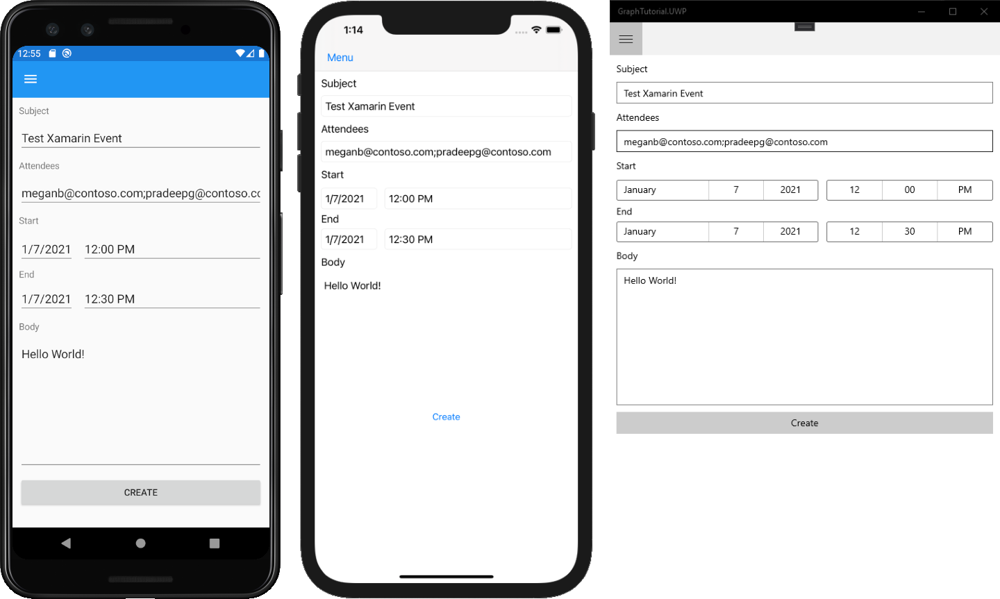

<!-- markdownlint-disable MD002 MD041 -->

In diesem Abschnitt fügen Sie die Möglichkeit zum Erstellen von Ereignissen im Kalender des Benutzers hinzu.

1. Fügen Sie eine neue Seite für die neue Ereignisansicht hinzu. Klicken Sie im Projektmappen-Explorer mit der rechten Maustaste auf das Projekt **GraphTutorial,** und wählen **Sie > Neues Element hinzufügen... aus.** Wählen **Sie "Leere Seite"** aus, `NewEventPage.xaml` geben Sie das Feld **"Name"** ein, und wählen Sie **"Hinzufügen" aus.**

1. Öffnen **Sie NewEventPage.xaml,** und ersetzen Sie den Inhalt durch Folgendes.

    :::code language="xaml" source="../demo/GraphTutorial/GraphTutorial/NewEventPage.xaml" id="NewEventPageXamlSnippet":::

1. Öffnen **NewEventPage.xaml.cs,** und fügen Sie die folgenden `using` Anweisungen am Oberen Rand der Datei hinzu.

    :::code language="csharp" source="../demo/GraphTutorial/GraphTutorial/NewEventPage.xaml.cs" id="UsingStatementsSnippet":::

1. Fügen Sie **die Schnittstelle "INotifyPropertyChange"** der **Klasse "NewEventPage"** hinzu. Ersetzen Sie die vorhandene Klassendeklaration durch Folgendes.

    ```csharp
    [XamlCompilation(XamlCompilationOptions.Compile)]
    public partial class NewEventPage : ContentPage, INotifyPropertyChanged
    {
        public NewEventPage()
        {
            InitializeComponent();
            BindingContext = this;
        }
    }
    ```

1. Fügen Sie der Klasse **NewEventPage die folgenden Eigenschaften** hinzu.

    :::code language="csharp" source="../demo/GraphTutorial/GraphTutorial/NewEventPage.xaml.cs" id="PropertiesSnippet":::

1. Fügen Sie den folgenden Code hinzu, um das Ereignis zu erstellen.

    :::code language="csharp" source="../demo/GraphTutorial/GraphTutorial/NewEventPage.xaml.cs" id="CreateEventSnippet":::

1. Speichern Sie die Änderungen, und führen Sie die App aus. Melden Sie sich an, wählen Sie **das** Menüelement  "Neues Ereignis", füllen Sie das Formular aus, und wählen Sie "Erstellen" aus, um dem Kalender des Benutzers ein Ereignis hinzuzufügen.

    
